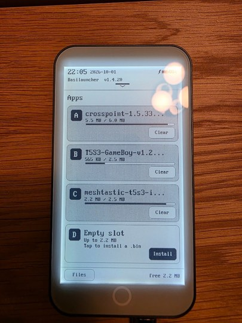
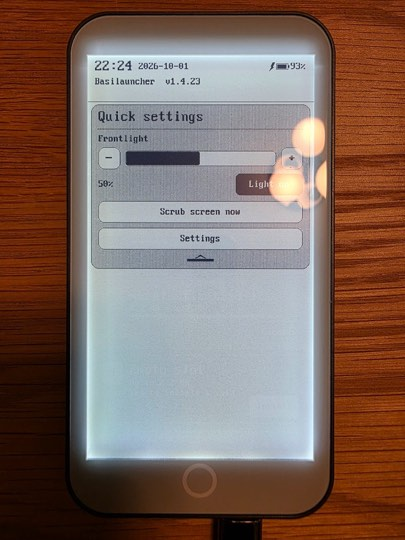
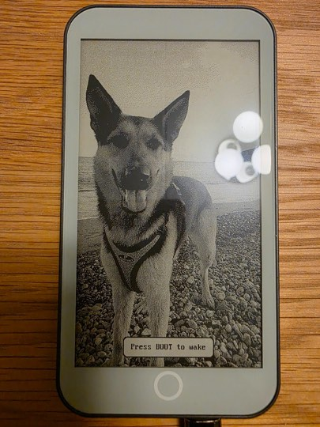

# Basilauncher

**Multi-app firmware hub for the [LilyGO T5 E-Paper S3 Pro](https://www.lilygo.cc/)**

[](LICENSE)
[](https://docs.espressif.com/projects/esp-idf/en/latest/esp32s3/)
[](https://github.com/Xinyuan-LilyGO/T5-e-paper-s3)
[](platformio.ini)

Basilauncher is a **factory-partition launcher**: it boots first after reset, lets you
install guest firmwares from the SD card into flash slots, and comes back when you
**double-press RST** — without patching those guests.

If Basilauncher is useful on your T5 Pro, a GitHub star helps others find it.

## Download

Pre-built images: **[Releases](https://github.com/nikbasi/basilauncher/releases)** (latest: [v1.4.23](https://github.com/nikbasi/basilauncher/releases/tag/v1.4.23)).

**Easiest install:** open the **[web flasher](https://nikbasi.github.io/basilauncher/flash/)** (Chrome/Edge), plug in the T5 Pro, click **Connect & flash**.

| Asset | Offset | When |
|-------|--------|------|
| **`basilauncher-*-full.bin`** | **`0x0`** | **First install — one file** (also what the web flasher uses) |
| `basilauncher-*-t5pro.bin` | `0x10000` | Everyday hub update (guests untouched) |
| `basil-bootloader.bin` | `0x0` | Bootloader-only refresh |
| `basilauncher-*-partitions.bin` | `0x8000` | Partition table only |

**First install via esptool (one file):**

```bash
esptool.py --chip esp32s3 -p PORT write-flash 0x0 basilauncher-1.4.23-full.bin
# Optional but fine — full image already contains erased otadata (0xFF @ 0xe000):
esptool.py --chip esp32s3 -p PORT erase-region 0xe000 0x2000
```

`erase-region 0xe000 0x2000` clears the OTA boot pointer so the device starts Basilauncher (factory) instead of a leftover guest.

Full recipes: **[docs/flashing.md](docs/flashing.md)** · **[Web flasher](https://nikbasi.github.io/basilauncher/flash/)**.

## Hardware

| | |
|---|---|
| **Board** | LilyGO T5 E-Paper S3 Pro (`T5-ePaper-S3-Pro`, ESP32-S3 + 8 MB PSRAM) |
| **Panel** | 960×540 e-paper (UI is portrait 540×960) |
| **Touch** | GT911 |
| **Power** | BQ25896 charger + fuel gauge |
| **Storage** | microSD (apps under `/firmware`, sleep art under `/sleep`) |

Also searchable as: *LilyGO T5 S3 Pro*, *T5 epaper S3 Pro*, *ESP32-S3 e-ink launcher*.

## Features

- **Four guest slots** (`ota_0`…`ota_3`) — best-fit install from `/firmware/*.bin`
- **Protected factory hub** — on-device UI never overwrites the launcher
- **RST double-press** custom bootloader — return from any guest without app changes
- **Files explorer** — browse SD, install bins, view BMPs, edit text, clipboard
- **Quick settings shade** — frontlight, scrub, jump to Settings
- **Sleep screensaver** — random BMPs from `/sleep` or `/.sleep`, short BOOT to change, hold BOOT to wake
- **Clock + battery** — RTC time, charge lightning / USB plug cues
- **1 MB `spiffs`** — so Meshtastic-style guests can mount InternalFS

## Screenshots

<p align="center">
  
  &nbsp;
  
  &nbsp;
  
</p>

<p align="center"><em>Home · Quick settings · Sleep</em></p>

## Quick start

```bash
git clone --recurse-submodules https://github.com/nikbasi/basilauncher.git
cd basilauncher
pio run -e basilauncher
pio run -e basilauncher -t upload   # factory @ 0x10000 only; guests untouched
```

**First flash on a blank board** (partition table + custom bootloader once):

```bash
# See docs/flashing.md for the full recipe and warnings.
python3 -m esptool --chip esp32s3 -p /dev/cu.usbmodem101 write-flash \
  0x0     bootloader/basil-bootloader.bin \
  0x8000  .pio/build/basilauncher/partitions.bin \
  0x10000 .pio/build/basilauncher/firmware.bin
python3 -m esptool --chip esp32s3 -p /dev/cu.usbmodem101 erase-region 0xe000 0x2000
```

More detail: **[docs/flashing.md](docs/flashing.md)** · **[docs/partitions.md](docs/partitions.md)** · **[docs/guest-apps.md](docs/guest-apps.md)**

## Returning to the launcher

| Reset | Boots |
|-------|-------|
| **RST pressed twice** within ~0.8 s | Basilauncher (otadata cleared) |
| RST once / power-on | Same app (short wait after first press) |
| USB host reset, app restart, deep-sleep wake, WDT, crash | Same app, no wait |

Double-press **RST** from any guest to get back here.

## SD card layout

```
/firmware/          # .bin images to install into empty slots
  crosspoint-….bin
  meshtastic-….bin
  …
/sleep/             # optional portrait BMPs for the screensaver
  01_forest.bmp
```

Tap a file in **Files** → installs into the **smallest empty slot that fits**.
Clear a slot from the home cards when you need space.

## Build notes

Uses FreeInk display path: `BoardT5S3` + `LgfxEpd` + M5GFX (not FastEPD — FastEPD’s
T5 Pro panel path drives the frontlight pin as data).

```ini
; platformio.ini upload writes ONLY factory @ 0x10000, then clears otadata
```

SDK: submodule [`nikbasi/freeink-sdk`](https://github.com/nikbasi/freeink-sdk) (FreeInk-derived, with LilyGO T5 charge / clean-bank fixes used by this hub).

## License

MIT — see [LICENSE](LICENSE). FreeInk SDK is MIT (FreeInk / OpenX4 lineage); M5GFX has its own license via PlatformIO.

## Related

- [LilyGO T5 e-Paper S3](https://github.com/Xinyuan-LilyGO/T5-e-paper-s3)
- [FreeInk](https://freeink.org/) / [freeink-sdk](https://github.com/nikbasi/freeink-sdk)
- Guest examples often used on this board: CrossPoint reader, Meshtastic InkHUD, Flashcards, GameBoy ports
